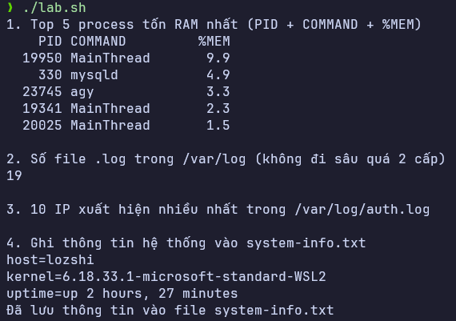
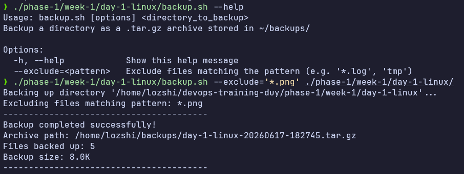
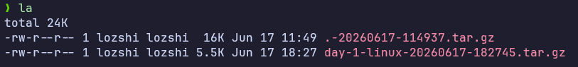

# Task: Linux fundamentals

- **Intern**: Trương Quang Duy
- **Phase/Week/Day**: phase-1/week-1/day-1
- **Branch**: phase-1/week-1/day-1-linux
- **Submitted at**: 2026-06-17 18:45
- **Time spent**: 4h

# 1. Mục Tiêu

- Tìm hiểu các lệnh linux cơ bản
- Viết được script đơn giản để observe hệ thống
- Viết được script để backup folder bằng cách nén và đưa sang thư mục backup

# 2. Cách chạy và kết quả

## Part A

Đã tổng hợp chi tiết mô tả và ví dụ sử dụng cho lệnh Linux cơ bản trong file [notes.md](./notes.md).

## Part B

```shell
echo "1. Top 5 process tốn RAM nhất"
ps -eo pid,comm,%mem --sort=-%mem | head -n 6

echo ""
echo "2. Số file .log trong /var/log"
find /var/log -maxdepth 2 -name "*.log" 2>/dev/null | wc -l

echo ""
echo "3. 10 IP xuất hiện nhiều nhất trong /var/log/auth.log"

if [ -r /var/log/auth.log ]; then
    grep -oE '[0-9]{1,3}\.[0-9]{1,3}\.[0-9]{1,3}\.[0-9]{1,3}' /var/log/auth.log | sort | uniq -c | sort -nr | head -n 10
else
    echo "File /var/log/auth.log không tồn tại hoặc không có quyền đọc (Cần chạy với quyền sudo)."
fi

echo ""
echo "4. Lấy hostname + kernel version + uptime"

printf "host=%s\nkernel=%s\nuptime=%s\n" "$(hostname)" "$(uname -r)" "$(uptime -p)" | tee system-info.txt
echo "Đã lưu thông tin vào file system-info.txt"
```

### Cách chạy

```bash
chmod +x ./lab.sh
./lab.sh
```

### Kết quả ví dụ



Ở đây vì chưa có ai truy cập vào máy em nên chưa có IP xuất hiện ở trong auth.log

---

## Part C

Kịch bản Shell Script tự động sao lưu một thư mục chỉ định dưới định dạng nén `.tar.gz` lưu trữ tại thư mục `~/backups/`.

```shell
#!/usr/bin/env bash
set -euo pipefail

# =====================================================================
# Script: backup.sh
# Description: Backup a directory as a .tar.gz archive in ~/backups/
# =====================================================================

# Function to show help and usage instructions
show_help() {
    echo "Usage: $(basename "$0") [options] <directory_to_backup>"
    echo "Backup a directory as a .tar.gz archive stored in ~/backups/"
    echo ""
    echo "Options:"
    echo "  -h, --help            Show this help message"
    echo "  --exclude=<pattern>   Exclude files matching the pattern (e.g. '*.log', 'tmp')"
}

# Function to perform the backup and print statistics
perform_backup() {
    local target_dir="$1"
    local exclude_pattern="${2:-}"

    # Check if the target directory exists
    if [ ! -d "$target_dir" ]; then
        echo "Error: Directory '$target_dir' does not exist." >&2
        exit 1
    fi

    # Resolve absolute path to prevent naming the backup '.' when '.' is passed
    local target_abs_path
    target_abs_path=$(realpath "$target_dir")

    # Ensure backup directory exists
    local backup_dir="$HOME/backups"
    mkdir -p "$backup_dir"

    # Get directory name and timestamp
    local dir_basename
    dir_basename=$(basename "$target_abs_path")
    local timestamp
    timestamp=$(date +%Y%m%d-%H%M%S)

    local backup_file="${dir_basename}-${timestamp}.tar.gz"
    local backup_path="${backup_dir}/${backup_file}"

    echo "Backing up directory '$target_abs_path'..."

    # Compress the source directory from its parent folder, applying exclude pattern if set
    if [ -n "$exclude_pattern" ]; then
        echo "Excluding files matching pattern: $exclude_pattern"
        tar --exclude="$exclude_pattern" -czf "$backup_path" -C "$(dirname "$target_abs_path")" "$dir_basename"
    else
        tar -czf "$backup_path" -C "$(dirname "$target_abs_path")" "$dir_basename"
    fi

    # Calculate count of files and size of the generated archive
    # Use grep -v '/$' to exclude directories from the file count
    local file_count
    file_count=$(tar -tzf "$backup_path" | grep -v '/$' | wc -l)

    local backup_size
    backup_size=$(du -sh "$backup_path" | cut -f1)

    echo "----------------------------------------"
    echo "Backup completed successfully!"
    echo "Archive path: $backup_path"
    echo "Files backed up: $file_count"
    echo "Backup size: $backup_size"
    echo "----------------------------------------"
}

# --- Command Line Arguments Parsing ---

# If no arguments provided, show help and exit with 1
if [ $# -eq 0 ]; then
    show_help
    exit 1
fi

exclude_pattern=""
input_dir=""

while [[ $# -gt 0 ]]; do
    case "$1" in
        -h|--help)
            show_help
            exit 0
            ;;
        --exclude=*)
            exclude_pattern="${1#*=}"
            shift
            ;;
        --exclude)
            if [[ $# -gt 1 ]]; then
                exclude_pattern="$2"
                shift 2
            else
                echo "Error: --exclude requires an argument." >&2
                exit 1
            fi
            ;;
        -*)
            echo "Error: Unknown option $1" >&2
            show_help
            exit 1
            ;;
        *)
            if [[ -z "$input_dir" ]]; then
                input_dir="${1%/}"
                shift
            else
                echo "Error: Multiple target directories specified." >&2
                show_help
                exit 1
            fi
            ;;
    esac
done

# Ensure a target directory was specified
if [[ -z "$input_dir" ]]; then
    echo "Error: Missing target directory to backup." >&2
    show_help
    exit 1
fi

# Run the backup process
perform_backup "$input_dir" "$exclude_pattern"
```

### Chạy script

```bash
chmod +x ./backup.sh

# Chạy sao lưu thông thường
./backup.sh <directory_to_backup>

# Chạy sao lưu có loại trừ các file/thư mục trùng khớp với mẫu (pattern)
./backup.sh --exclude="*.log" <directory_to_backup>
```

### Kết quả ví dụ



Ở folder ~/backups



### Mở rộng

Em đã thêm flag --exclude=`<pattern>` cho Part C

Ở phần này em sử dụng các alias:

```bash
alias ll='ls -alF'
alias la='ls -A'
alias l='ls -CF'
```

# 3. Vấn đề

- Không có IP nào truy cập => Giải quyết: Do chưa bật ssh server và không có ai truy cập vào máy nên không có IP nào truy cập là đúng.

# 4. Reference

- Em sử dụng AI để tra cứu nhanh những lệnh chưa biết và để làm rõ các syntax mới.

# 5. Self-check

- [x] Code chạy được trên máy sạch.
- [x] README có hướng dẫn run lại.
- [x] Không hard-code secret.
- [x] Commit message theo Conventional Commits.
- [x] Đã review lại code 1 lượt.
