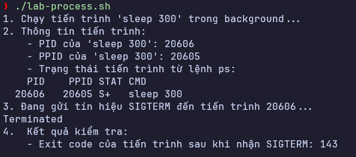
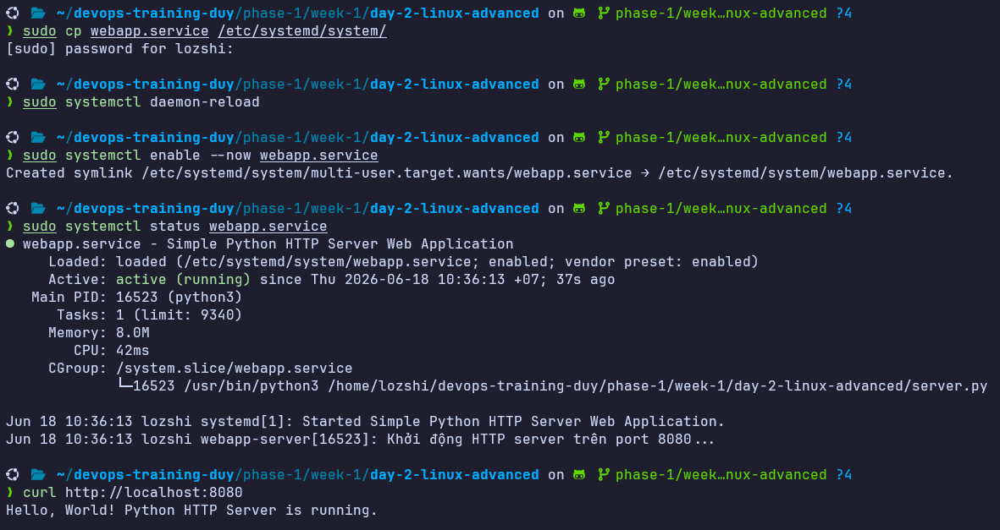
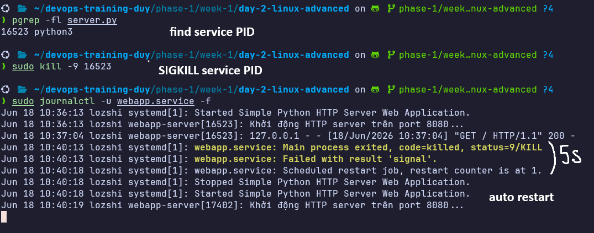
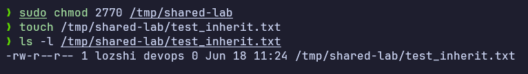
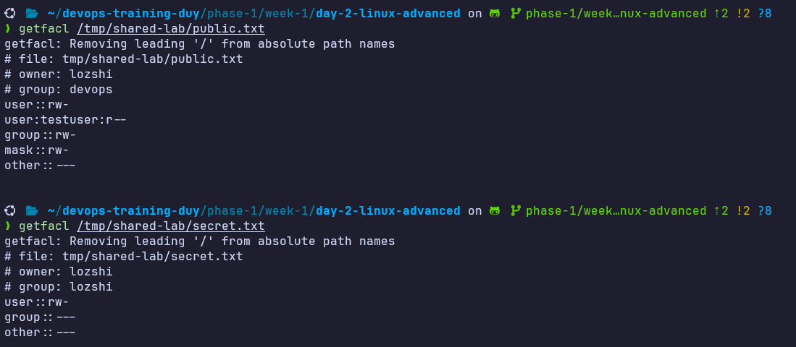
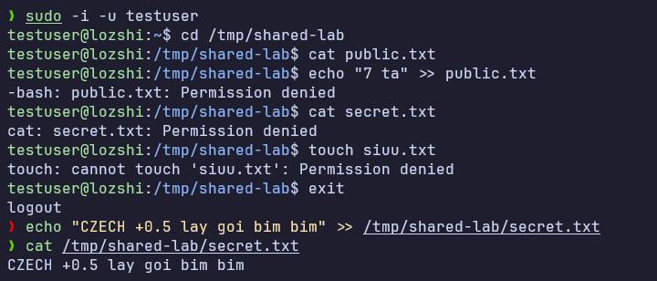
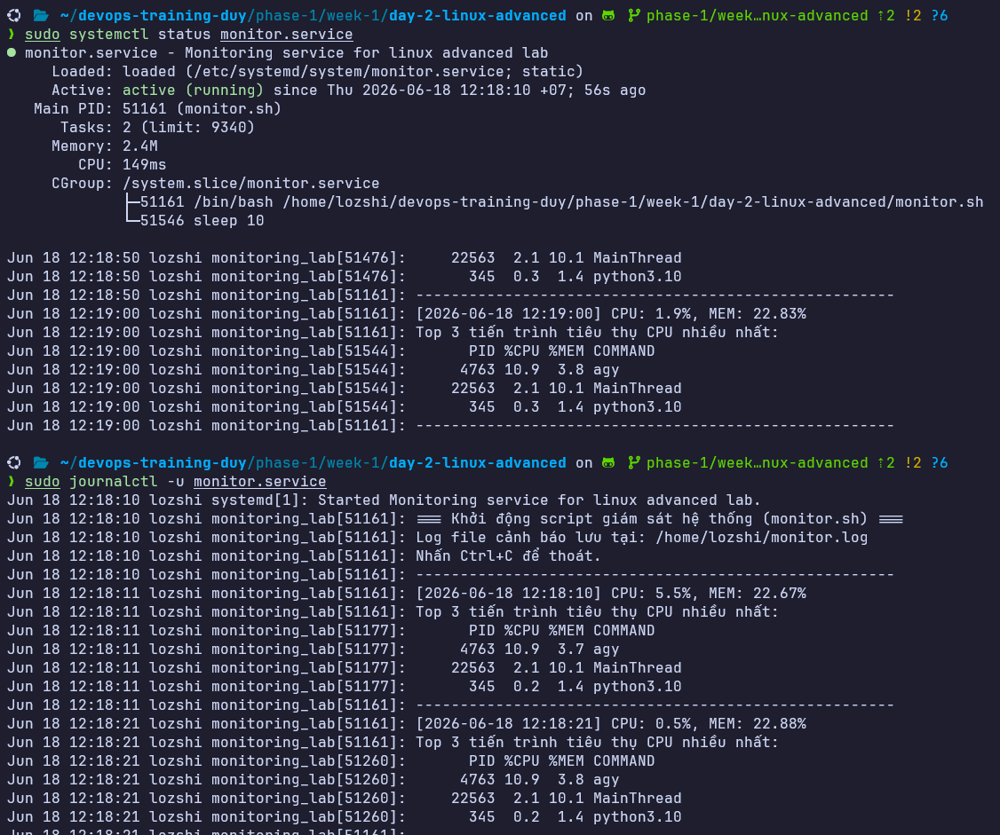
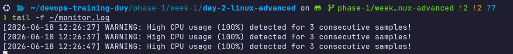

# Task: Linux Advanced

- **Intern**: Trương Quang Duy
- **Phase/Week/Day**: phase-1/week-1/day-2-linux-advanced
- **Branch**: phase-1/week-1/day-2-linux-advanced
- **Submitted at**: 2026-06-18
- **Time spent**: 6h

# 1. Mục Tiêu

- Hiểu process tree, signal, foreground/background, nohup/disown.
- Viết được 1 systemd unit để daemonize service.
- Biết một số cách quản lý permission nâng cao: setuid/setgid/sticky bit, ACL.

---

# 2. Cách chạy và kết quả chi tiết

## Part A: Process và Signal

### 1. File lý thuyết `notes.md`

Đã trả lời các câu hỏi về tín hiệu, các lệnh quản lý chạy ngầm, trạng thái tiến trình và Zombie process.
Xem chi tiết tại: [notes.md](./notes.md)

---

### 2. Lab `lab-process.sh`

Chạy ngầm một tiến trình `sleep 300`, hiển thị cấu trúc PID/PPID của nó, sau đó gửi tín hiệu kết thúc `SIGTERM` và in ra mã thoát trả về.

#### Cách chạy:

```bash
# Cấp quyền thực thi và chạy script
chmod +x ./lab-process.sh
./lab-process.sh
```

#### Kết quả chạy thực tế:



_Tiến trình sleep 300 được spawn ngầm. Khi bị kết thúc bởi SIGTERM (Signal 15), lệnh wait nhận được exit code 143 (bằng 128 + 15)._

---

## Part B: WebApp Service (Python HTTP Server & Systemd)

Xây dựng ứng dụng Python HTTP Server đơn giản chạy trên cổng `8080` ([server.py](./server.py)) và cấu hình Systemd Unit file ([webapp.service](./webapp.service)) để quản lý.

### Cách chạy:

```bash
# 1. Copy file service vào thư mục cấu hình Systemd
sudo cp webapp.service /etc/systemd/system/

# 2. Nạp lại cấu hình daemon để Systemd nhận dạng dịch vụ mới
sudo systemctl daemon-reload

# 3. Khởi chạy service
sudo systemctl start webapp.service

# 4. Kiểm tra trạng thái hoạt động của dịch vụ
sudo systemctl status webapp.service
```

### Kết quả triển khai dịch vụ:



_Trạng thái hoạt động của webapp.service và kết quả test kết nối HTTP thành công bằng curl._

---

### Test cơ chế Auto Restart:

Với cấu hình `Restart=always` và `RestartSec=5`, nếu tiến trình Python bị crash hoặc bị kill đột ngột bằng `kill -9`, Systemd sẽ tự động khởi động lại nó sau 5 giây.

#### Cách test:

```bash
# 1. Tìm PID của server đang chạy
pgrep -fl server.py

# 2. Ép buộc tắt tiến trình bằng SIGKILL (Signal 9)
sudo kill -9 <PID>

# 3. Theo dõi log xem dịch vụ tự phục hồi
sudo journalctl -u webapp.service -f
```

#### Kết quả kiểm tra log tự động restart:



_Log ghi nhận tiến trình bị tắt bằng Signal 9, chuyển sang trạng thái tự khởi động lại sau 5 giây với PID mới hoàn toàn._

---

## Part C: Linux Permissions Lab (Group, SetGID & ACL)

Thực hiện phân quyền nâng cao trên thư mục chia sẻ `/tmp/shared-lab` nhằm kiểm soát quyền đọc/ghi nghiêm ngặt giữa các nhóm và người dùng cụ thể.

Chi tiết từng lệnh cài đặt và phân quyền được lưu tại: [permissions-lab.md](./permissions-lab.md)

### 1. Kiểm tra tính năng kế thừa Group (SetGID)

Khi tạo thư mục với quyền `2770`, mọi file/thư mục mới tạo bên trong sẽ tự động kế thừa group sở hữu `devops` thay vì group chính của user tạo ra.



_File test_inherit.txt mới tạo tự động thuộc nhóm sở hữu devops nhờ bit SetGID được kích hoạt trên thư mục cha._

---

### 2. Kiểm tra phân quyền ACL chi tiết

Sử dụng `setfacl` để gán quyền đọc cho `testuser` trên thư mục cha và file cụ thể. Kiểm tra lại bằng lệnh `getfacl`.



_Lệnh getfacl hiển thị quyền chi tiết của chủ sở hữu, nhóm devops và quyền đọc riêng cho testuser._

---

### 3. Kiểm chứng quyền truy cập của `testuser`

Chuyển sang tài khoản `testuser` để thực hiện đọc/ghi kiểm tra các file bảo mật và công khai.



_testuser đọc thành công file public nhưng không thể ghi (Permission denied) và hoàn toàn không thể đọc file secret.txt._

---

## Part D: Giám sát Hệ thống (Monitor Script & Service)

Xây dựng script giám sát tài nguyên hệ thống theo thời gian thực ([monitor.sh](./monitor.sh)) và đóng gói thành dịch vụ Systemd chạy thủ công ([monitor.service](./monitor.service)).

### 1. Cách chạy giám sát thông thường:

```bash
# Cấp quyền thực thi và khởi chạy script
chmod +x ./monitor.sh
./monitor.sh
```

### 2. Chạy service bằng systemd (Chạy thủ công):

```bash
# 1. Copy file service vào thư mục cấu hình Systemd
sudo cp monitor.service /etc/systemd/system/

# 2. Nạp lại cấu hình daemon
sudo systemctl daemon-reload

# 3. Khởi chạy service
sudo systemctl start monitor.service

# 4. Kiểm tra trạng thái hoạt động của dịch vụ
sudo systemctl status monitor.service

# 5. Theo dõi log dịch vụ thời gian thực qua journald
sudo journalctl -u monitor.service -f
```

#### Kết quả in thông số tài nguyên:



_Script hiển thị CPU%, MEM% và liệt kê top 3 tiến trình chiếm tài nguyên nhiều nhất sau mỗi 10 giây._

---

### 2. Test cảnh báo quá tải CPU (>80% trong 3 mẫu liên tiếp):

Đẩy tải CPU lên cao bằng cách chạy song song các phép toán hash trên toàn bộ các nhân CPU, sau đó kiểm tra ghi nhận log cảnh báo tại `~/monitor.log`.

#### Các bước test:

```bash
# 1. Tạo tải CPU cao ngầm trên toàn bộ các nhân
for i in $(seq 1 $(nproc)); do sha1sum /dev/zero > /dev/null & done

# 2. Theo dõi log file cảnh báo
tail -f ~/monitor.log

# 3. Sau khi test xong, dừng ngay các tiến trình tạo tải để hạ nhiệt hệ thống
pkill -f "sha1sum /dev/zero"
```

#### Kết quả ghi log cảnh báo:



_Log ghi nhận cảnh báo WARNING khi phát hiện CPU duy trì ở mức >80% (thực tế ~100%) trong 3 chu kỳ liên tiếp._

---

# 3. Reference

- [systemd explained](https://www.youtube.com/watch?v=Kzpm-rGAXos).
- [systemd for Administrators, Part II](https://0pointer.de/blog/projects/systemd-for-admins-2.html).
- [acl manual](https://www.redhat.com/en/blog/linux-access-control-lists)
- Em sử dụng AI để tra cứu nhanh những thông tin chưa biết và để làm rõ các syntax mới.

---

# 4. Self-check

- [x] README có hướng dẫn run lại chi tiết cho từng phần.
- [x] Không hard-code các giá trị/bí mật nhạy cảm.
- [x] Đã review lại toàn bộ code và cấu hình.
