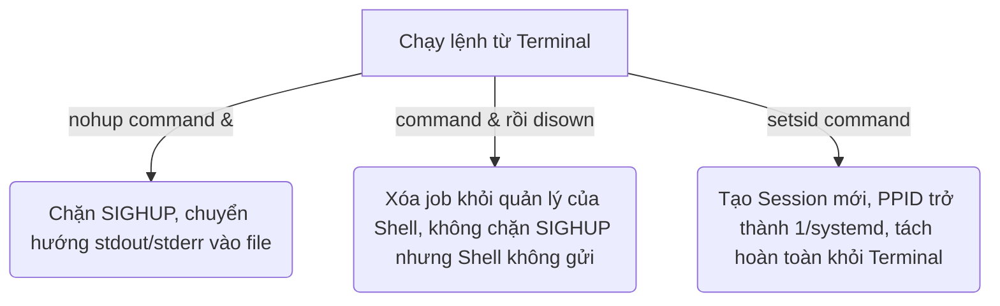

## 1. Sự khác nhau giữa SIGTERM, SIGKILL, SIGHUP, SIGINT

Trong Linux, Signal là một cơ chế giao tiếp liên tiến trình bất đồng bộ được sử dụng để thông báo cho tiến trình về một sự kiện cụ thể. Dưới đây là bảng so sánh chi tiết giữa 4 tín hiệu phổ biến:

| Tên Tín hiệu | Số | Cách kích hoạt thông thường | Khả năng catch/ignore? | Hành vi & Mục đích sử dụng |
| :--- | :---: | :--- | :---: | :--- |
| **SIGINT** | `2` | Nhấn tổ hợp phím `Ctrl + C` trên terminal điều khiển. | **Có thể** | Yêu cầu tiến trình dừng ngay lập tức. Tiến trình nhận tín hiệu có thể bắt để thực hiện dọn dẹp dữ liệu tạm trước khi kết thúc một cách an toàn. |
| **SIGTERM** | `15` | Chạy lệnh `kill <PID>` (tín hiệu mặc định). | **Có thể** | Yêu cầu tiến trình kết thúc một cách lịch sự (Graceful Shutdown). Tiến trình có thời gian lưu trạng thái, đóng các kết nối mạng, giải phóng tài nguyên rồi mới thoát. Đây là cách tắt tiến trình được khuyến nghị nhất. |
| **SIGKILL** | `9` | Chạy lệnh `kill -9 <PID>` hoặc `kill -KILL <PID>`. | **Không thể** | Kết thúc tiến trình ngay lập tức. Tín hiệu này không gửi cho tiến trình mà gửi trực tiếp cho Kernel, Kernel sẽ giải phóng tài nguyên của tiến trình ngay lập tức. Có thể gây mất dữ liệu hoặc hỏng file do tiến trình không có thời gian dọn dẹp. |
| **SIGHUP** | `1` | Khi đóng terminal điều khiển tiến trình (mất kết nối SSH...). | **Có thể** | Mặc định là kết thúc tiến trình. Tuy nhiên, các tiến trình chạy ngầm (daemons như Nginx, Apache, Systemd) thường bắt tín hiệu này để **tải lại file cấu hình (reload config)** mà không cần khởi động lại tiến trình (không làm gián đoạn dịch vụ). |

---

## 2. So sánh `nohup` vs `disown` vs `setsid`

Cả ba công cụ này đều được sử dụng để duy trì sự hoạt động của tiến trình sau khi tắt terminal hoặc ngắt kết nối SSH, nhưng cách thức hoạt động của chúng rất khác nhau:



### a) `nohup` (No Hangup)
*   **Cú pháp:** `nohup command > output.log 2>&1 &`
*   **Cơ chế:**
    *   Nó là một lệnh bao bọc bên ngoài. Nó thiết lập bộ xử lý tín hiệu để **bỏ qua (ignore) tín hiệu SIGHUP**.
    *   Nếu bạn không chuyển hướng đầu ra, `nohup` sẽ tự động ghi đè hoặc tạo file `nohup.out` trong thư mục hiện tại (hoặc thư mục home) để lưu `stdout` và `stderr`.
    *   Tiến trình con vẫn có tiến trình cha (`PPID`) là Shell hiện tại. Khi shell tắt, kernel gửi `SIGHUP` tới nhóm tiến trình nhưng tiến trình được chạy với `nohup` sẽ lờ đi và tiếp tục chạy.
    *   Dùng nohup khi chuẩn bị chạy một lệnh ngầm từ đầu và muốn có một file log để sau này check.

### b) `disown`
*   **Cú pháp:** `command &` sau đó gõ `disown` (hoặc `disown -h %1` / `disown PID`)
*   **Cơ chế:**
    *   Là một shell builtin (chỉ có trong Bash, Zsh...).
    *   Nó không chặn tín hiệu `SIGHUP` của tiến trình. Thay vào đó, nó **xóa tiến trình khỏi danh sách công việc (job table)** của Shell hiện tại. Khi shell đóng, shell sẽ không gửi tín hiệu `SIGHUP` đến tiến trình đó nữa.
    *   **Lưu ý quan trọng:** `disown` không tự động chuyển hướng `stdout` và `stderr`. Nếu tiến trình cố gắng ghi dữ liệu vào terminal đã bị đóng, nó có thể nhận tín hiệu `SIGPIPE` và bị crash, trừ khi bạn đã chuyển hướng đầu ra khi khởi chạy (ví dụ: `command >/dev/null 2>&1 &`).
    *   Dùng disown khi lệnh đang chạy dở và bạn chợt nhớ ra là mình phải tắt Terminal.

### c) `setsid`
*   **Cú pháp:** `setsid command`
*   **Cơ chế:**
    *   Nó chạy tiến trình trong một **Session mới** hoàn toàn (gọi system call `setsid()`).
    *   Tiến trình mới này sẽ trở thành session leader và không có terminal điều khiển (controlling terminal).
    *   Tiến trình cha (`PPID`) của nó sẽ được gán trực tiếp cho tiến trình `init` hoặc `systemd` (PID `1`).
    *   Vì hoàn toàn tách biệt khỏi shell cha, tiến trình sẽ không bao giờ nhận được tín hiệu `SIGHUP` khi terminal đóng.
    *   Dùng `setsid` khi viết các script tự động nâng cao, các tiến trình dạng daemon ngầm mà bạn muốn nó độc lập hoàn toàn tuyệt đối với Shell gọi nó ngay từ đầu.

### Bảng tóm tắt so sánh:

| Đặc điểm | `nohup` | `disown` | `setsid` |
| :--- | :--- | :--- | :--- |
| **Loại công cụ** | Lệnh độc lập (External Utility) | Shell Built-in (Bash/Zsh) | Lệnh độc lập (System Call) |
| **PPID sau khi shell đóng** | Trở thành `1` (systemd/init) | Trở thành `1` (systemd/init) | Ngay từ đầu đã là `1` (systemd/init) |
| **Tự động chuyển hướng I/O** | Có (mặc định vào `nohup.out`) | Không | Không |
| **Thời điểm sử dụng** | Trước khi chạy tiến trình | Sau khi tiến trình đã chạy | Trước khi chạy tiến trình |

---

## 3. Khi nào dùng `pkill -f`?

Lệnh `pkill` dùng để gửi tín hiệu (mặc định là SIGTERM) đến các tiến trình dựa trên tên của chúng. Tuy nhiên, mặc định `pkill` chỉ so khớp mẫu tìm kiếm với **tên của file thực thi (executable name)**, giới hạn trong 15 ký tự đầu tiên.

### Khi nào cần thêm flag `-f` (Full command line)?
Dùng `pkill -f` khi muốn so khớp mẫu tìm kiếm trên **toàn bộ dòng lệnh khởi chạy (full command line)** bao gồm cả các tham số truyền vào (arguments), đường dẫn tuyệt đối hoặc các biến môi trường đi kèm.

#### Các trường hợp cụ thể:
1.  **Tiến trình chạy qua trình thông dịch (Python, Node.js, Java, Bash):**
    *   Nếu chạy `python script_a.py` and `python script_b.py`, tên tiến trình thực tế lưu trong kernel cho cả hai đều là `python`.
    *   Nếu dùng `pkill python` sẽ kill **cả hai** script.
    *   Để chỉ kill `script_a.py` phải dùng:
        ```bash
        pkill -f script_a.py
        ```
2.  **Khớp theo đường dẫn tuyệt đối hoặc đường dẫn thư mục:**
    *   Nếu có nhiều bản chạy của cùng một ứng dụng ở các thư mục khác nhau, ví dụ `/var/www/app1/server` và `/var/www/app2/server`.
    *   Để chỉ kill tiến trình của `app1`, sử dụng:
        ```bash
        pkill -f /var/www/app1/
        ```
3.  **Khớp theo tham số cấu hình (Port, Environment Variables):**
    *   Ví dụ chạy ứng dụng Node với cổng: `node app.js --port 8080`.
    *   Kill bằng cách:
        ```bash
        pkill -f "--port 8080"
        ```

> [!CAUTION]
> Vì `-f` tìm kiếm trên toàn bộ dòng lệnh, nó rất dễ so khớp nhầm với các tiến trình không mong muốn (ví dụ như chính lệnh `grep` hoặc các script giám sát hệ thống khác có chứa từ khóa đó). Luôn luôn kiểm tra trước bằng lệnh `pgrep -fa <pattern>` để xem những tiến trình nào sẽ bị ảnh hưởng trước khi thực hiện `pkill -f <pattern>`.

---

## 4. Giải thích cột STAT trong output của lệnh `ps auxf`

Cột `STAT` (Process State) hiển thị trạng thái hiện tại của tiến trình. Ký tự đầu tiên (viết hoa) là trạng thái chính, các ký tự phía sau thể hiện các thuộc tính bổ sung.

### Các trạng thái chính:

*   **`R` (Running or Runnable):**
    *   Tiến trình đang chạy trên CPU hoặc đang nằm trong run queue, sẵn sàng chạy bất cứ khi nào có CPU trống.
*   **`S` (Interruptible Sleep):**
    *   Tiến trình đang ngủ để chờ một sự kiện hoặc tài nguyên (chờ dữ liệu từ mạng, ổ đĩa, hoặc người dùng nhập bàn phím).
    *   Nó có thể thức dậy ngay lập tức nếu nhận được một tín hiệu. Hầu hết các tiến trình hệ thống chạy ngầm ở trạng thái này.
*   **`D` (Uninterruptible Sleep - D Sleep):**
    *   Tiến trình đang ngủ sâu và **không thể bị ngắt bởi bất kỳ tín hiệu nào**.
    *   Thường xảy ra khi tiến trình đang chờ kết quả trực tiếp từ thao tác I/O phần cứng (như đọc ghi đĩa cứng vật lý hoặc ổ đĩa mạng NFS bị treo).
    *   **Lưu ý:** Bạn không thể giết tiến trình này bằng `kill -9` vì kernel sẽ chặn tín hiệu cho đến khi thao tác I/O hoàn thành hoặc hết thời gian timeout phần cứng.
*   **`Z` (Zombie / Defunct):**
    *   Tiến trình đã kết thúc (thực thi xong lệnh `exit()`) nhưng tiến trình cha chưa gọi hàm thu hồi (`wait()` hoặc `waitpid()`).
    *   Nó không tiêu tốn tài nguyên bộ nhớ hay CPU nhưng chiếm dụng một dòng trong Process Table kèm theo một mã định danh PID.
*   **`T` (Stopped / Traced):**
    *   Tiến trình đã bị tạm dừng, thường là do nhận tín hiệu dừng như `SIGSTOP` hoặc `SIGTSTP` (ví dụ khi người dùng nhấn `Ctrl + Z`).
    *   Nó cũng có thể ở trạng thái này khi đang bị kiểm tra bởi một debugger.

### Các ký tự bổ trợ thường gặp ở cột STAT:
*   **`<`**: Tiến trình có độ ưu tiên cao (nice value thấp - ưu tiên tài nguyên CPU).
*   **`N`**: Tiến trình có độ ưu tiên thấp (nice value cao - nhường tài nguyên CPU).
*   **`L`**: Tiến trình có các trang nhớ bị khóa cứng trong bộ nhớ vật lý RAM (không bị đẩy vào swap).
*   **`s`**: Tiến trình là Session Leader (chủ quản lý của một session tiến trình, ví dụ như tiến trình shell điều khiển terminal).
*   **`l`**: Tiến trình đa luồng (Multi-threaded - sử dụng `CLONE_THREAD`).
*   **`+`**: Tiến trình đang chạy ở chế độ foreground process group (nhận trực tiếp tương tác đầu vào từ terminal).

*Ví dụ: Trạng thái `Ss+` nghĩa là tiến trình đang ngủ tạm thời (S), là Session Leader (s) và đang chạy ở chế độ foreground (+).*

---

## 5. Zombie Process là gì và cách nhận diện?

### Zombie Process là gì?
Khi một tiến trình con kết thúc, hệ điều hành không xóa nó khỏi bảng tiến trình ngay lập tức. Thay vào đó, Kernel chuyển trạng thái của nó thành **Zombie**. Trạng thái này sinh ra nhằm giữ lại thông tin về exit status và các thông số thống kê tài nguyên để tiến trình cha đọc thông qua các system call như `wait()` hoặc `waitpid()`.

Một khi tiến trình cha đọc được thông tin này, zombie process sẽ hoàn toàn biến mất khỏi bảng tiến trình (gọi là thu hoạch - reaping). Nhưng nếu tiến trình cha bị lỗi và không bao giờ gọi `wait()`, tiến trình con sẽ bị kẹt lại ở trạng thái Zombie mãi mãi.

> [!NOTE]
> Bản thân Zombie process không sử dụng RAM hay CPU (chúng chỉ là một dòng text ghi nhận thông tin đã chết). Tuy nhiên, nếu số lượng Zombie quá nhiều, hệ thống có thể bị cạn kiệt PID, khiến hệ thống không thể khởi chạy thêm bất kỳ tiến trình mới nào khác.

### Làm sao nhận diện Zombie Process?

Bạn có thể nhận diện Zombie process bằng các cách sau:

#### Cách 1: Sử dụng lệnh `top` hoặc `htop`
*   Ở góc trên cùng của lệnh `top`, dòng thông tin tổng quan về tác vụ sẽ hiển thị trực tiếp số lượng zombie:
    ```text
    Tasks: 215 total,   1 running, 214 sleeping,   0 stopped,   2 zombie
    ```
#### Cách 2: Sử dụng lệnh `ps` và `grep`
*   Tìm cột trạng thái có ký tự `Z`:
    ```bash
    ps aux | grep 'Z'
    ```
*   Hoặc lọc cụ thể các tiến trình có nhãn `<defunct>` (tên thường thấy của Zombie):
    ```bash
    ps -ef | grep '[d]efunct'
    ```

### Làm thế nào để giải quyết Zombie Process?
Vì zombie đã chết, nên không thể dùng `kill -9 <Zombie_PID>` để kill. Để xử lý zombie, có 2 phương pháp chính:

1.  **Gửi tín hiệu SIGCHLD đến tiến trình cha:**
    ```bash
    kill -s SIGCHLD <Parent_PID>
    ```
    Tín hiệu này nhắc nhở tiến trình cha thực hiện dọn dẹp tiến trình con.
2.  **Khởi động lại hoặc giết tiến trình cha:**
    Nếu tiến trình cha không xử lý hoặc bị đơ, kill tiến trình cha:
    ```bash
    kill -9 <Parent_PID>
    ```
    Khi tiến trình cha bị tắt, zombie process sẽ trở thành orphan process. Tiến trình `init` hoặc `systemd` (PID 1) sẽ nhận chúng và tự động gọi `wait()` để dọn sạch các zombie này ngay lập tức.
