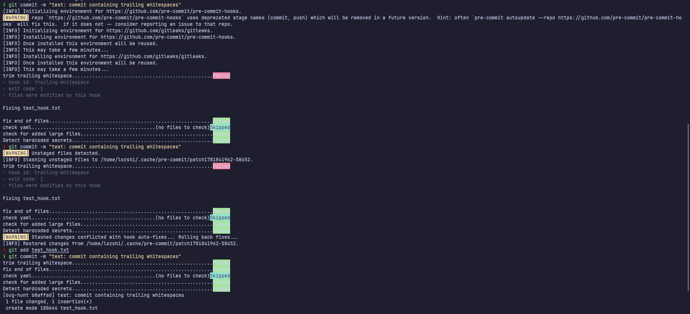

# Task: Git Advanced

- **Intern**: Trương Quang Duy
- **Phase/Week/Day**: phase-1/week-1/day-3-git-advanced
- **Branch**: phase-1/week-1/day-3-git-advanced
- **Submitted at**: 2026-06-19
- **Time spent**: 4h

# 1. Mục Tiêu

Thành thạo các kỹ năng Git nâng cao bao gồm Rebase, Cherry-pick, giải quyết xung đột thủ công, phục hồi commit bằng Reflog, dò tìm lỗi tự động bằng Bisect, và tích hợp các pre-commit hooks kiểm tra mã nguồn tự động.

---

# 2. Cách chạy và kết quả chi tiết

Chi tiết các bước chạy lệnh và kết quả của từng phần thực hành được đính kèm trực tiếp tại các tệp tin dưới đây:

Link repo thực hiện: https://github.com/duytrq/git-lab

## Part A (Rebase, Cherry-pick, Conflict & Squash)

Xem kết quả tại [history.md](./history.md).

## Part B (Tìm lại commit bị mất):

Xem hướng kết quả tại [reflog-lab.md](/reflog-lab.md).

## Part C (Dò lỗi tự động):

Xem toàn bộ log kết quả xác định commit lỗi qua [bisect.log](./bisect.log).

## Part D (Pre-commit Hook)

## Part E (So sánh Workflow):

Xem bảng đối chiếu chi tiết ưu/nhược điểm các mô hình tại [workflow-comparison.md](./workflow-comparison.md).

---

# 3. Reference

- [Progitbook](https://git-scm.com/book/en/v2/).
- [pre-commit doc](https://pre-commit.com/).
- [workflow compare](https://medium.com/@patibandha/gitflow-vs-github-flow-vs-trunk-based-development-dded3c8c7af1).
- Em sử dụng AI để tra cứu nhanh những thông tin chưa biết và để làm rõ các syntax mới.

---

# 4. Self-check

- [x] README có hướng dẫn run lại chi tiết cho từng phần.
- [x] Không hard-code các giá trị/bí mật nhạy cảm.
- [x] Đã review lại toàn bộ code và cấu hình.
