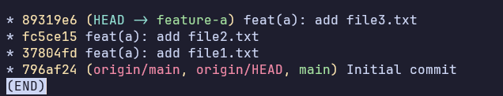
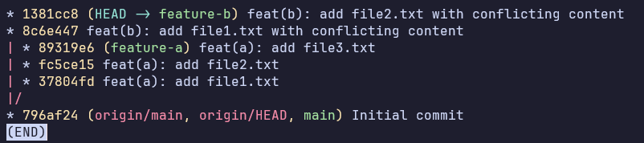
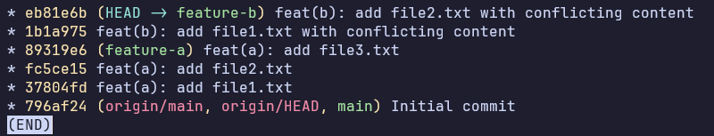
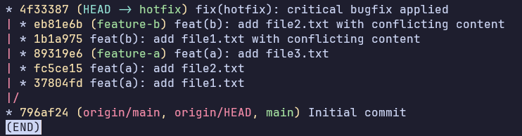
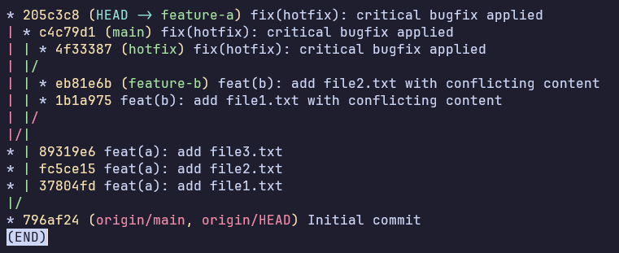
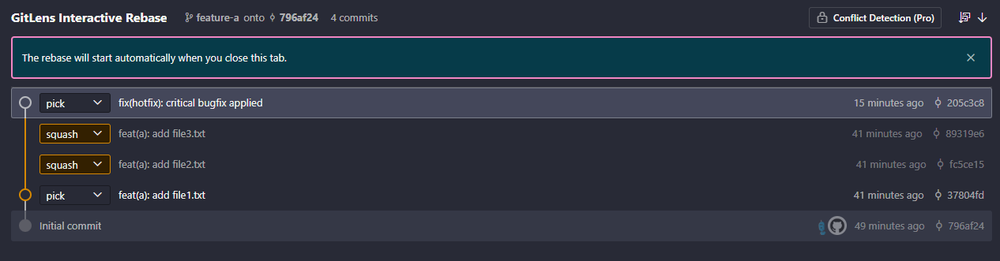
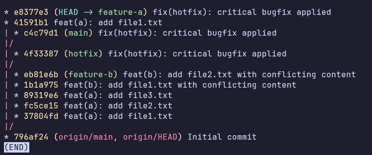

# 1. Tạo branch feature-a, commit 3 lần (3 file khác nhau).

# 2. Quay về main, tạo branch feature-b, commit 2 lần (chỉnh đè cùng file với feature-a).

# 3. Rebase feature-b lên feature-a → chủ động gây conflict → resolve thủ công

# 4. Tạo branch hotfix, commit 1 fix.

# 5. cherry-pick commit hotfix sang cả main và feature-a

# 6. Squash 3 commit của feature-a thành 1 bằng rebase -i.

