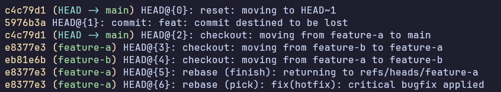
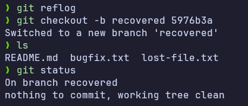

## 1. Dùng `git reflog` để tìm lại commit mất

```bash
git reflog
```



## 2. Xác định dòng log dạng của commit bị mất và copy mã SHA tương ứng.

## 3. Khôi phục commit này bằng cách check out ra một nhánh mới từ mã SHA đó:

```bash
git checkout -b recovered 5976b3a
```


