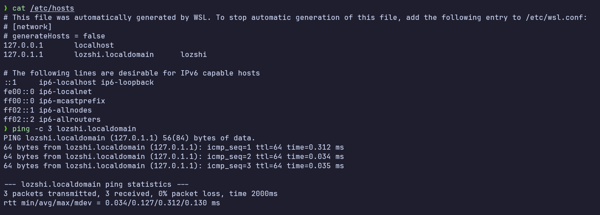

# DNS Lab & Name Resolution

## 1. Giải thích output của lệnh `dig +trace google.com`

Khi chạy lệnh `dig +trace google.com`, quá trình phân giải DNS được thực hiện theo cơ chế **truy vấn lặp (iterative query)** đi từ gốc đến ngọn (không sử dụng cache của local DNS resolver):

1. **Bước 1: Truy vấn các Root Servers (Gốc)**
   - Đầu tiên, `dig` gửi truy vấn đến local DNS resolver (ở đây là `10.255.255.254`) để lấy danh sách 13 Root DNS Servers (`a.root-servers.net` đến `m.root-servers.net` ký hiệu bằng dấu `.`).
2. **Bước 2: Truy vấn TLD Servers (Top-Level Domain)**
   - `dig` chọn ngẫu nhiên một Root Server (ví dụ: `d.root-servers.net` tại `199.7.91.13`) để hỏi địa chỉ của `google.com`.
   - Root Server không biết IP của `google.com`, nhưng nó biết máy chủ quản lý phần mở rộng `.com` (TLD Server). Nó trả về danh sách các NS (Name Server) của `.com` (ví dụ: `a.gtld-servers.net` đến `m.gtld-servers.net`).

3. **Bước 3: Truy vấn Authoritative Name Servers của Google**
   - `dig` gửi truy vấn tiếp theo đến một trong các `.com` TLD Servers (ví dụ: `b.gtld-servers.net` tại `192.33.14.30`).
   - TLD Server này trả về danh sách các Authoritative Name Servers chịu trách nhiệm trực tiếp cho domain `google.com`, bao gồm: `ns1.google.com` đến `ns4.google.com`.

4. **Bước 4: Nhận kết quả IP cuối cùng**
   - Cuối cùng, `dig` truy vấn trực tiếp một trong các Name Servers của Google (ví dụ: `ns4.google.com` tại `216.239.38.10`).
   - Máy chủ này trả về bản ghi A chứa IP thực tế của `google.com` (ví dụ: `142.250.197.78`).

---

## 2. Cấu hình `/etc/hosts` để map domain giả & verify với ping

Do file `/etc/hosts` là file hệ thống thuộc quyền sở hữu của `root`, việc chỉnh sửa yêu cầu quyền `sudo`.

### Các bước thực hiện:

1. Thêm dòng cấu hình ánh xạ domain giả `lozshi.localdomain` về IP loopback `127.0.0.1`:

   ```bash
   echo "127.0.0.1 lozshi.localdomain" | sudo tee -a /etc/hosts
   ```

2. Xác thực bằng lệnh `ping`:
   ```bash
   ping -c 3 lozshi.localdomain
   ```
   
---

## 3. Phân biệt `/etc/hosts`, `/etc/resolv.conf` và `systemd-resolved`

| Thành phần             | Loại                          | Chức năng chính                                                                                                 | Độ ưu tiên / Cách hoạt động                                                                                                                               |
| :--------------------- | :---------------------------- | :-------------------------------------------------------------------------------------------------------------- | :-------------------------------------------------------------------------------------------------------------------------------------------------------- |
| **`/etc/hosts`**       | File tĩnh (Plain text)        | Ánh xạ thủ công, trực tiếp giữa Hostname/Domain và IP address cục bộ.                                           | **Ưu tiên cao nhất**. Hệ thống sẽ kiểm tra file này đầu tiên (theo cấu hình `/etc/nsswitch.conf`) trước khi hỏi DNS Server ngoài.                         |
| **`/etc/resolv.conf`** | File cấu hình của Resolver    | Khai báo địa chỉ IP của các DNS Nameservers (ví dụ `nameserver 8.8.8.8`) để hệ thống gửi truy vấn DNS ra ngoài. | **Mức độ thư viện (glibc)**. Được các ứng dụng đọc trực tiếp để biết DNS Server nào cần truy vấn khi `/etc/hosts` không có thông tin.                     |
| **`systemd-resolved`** | Service nền hệ thống (Daemon) | Cung cấp dịch vụ quản lý phân giải DNS động, hỗ trợ DNS caching, quản lý DNS nhận từ DHCP/VPN, và DNSSEC/DoT.   | **Quản lý trung tâm**. Chạy ngầm và thường tạo ra DNS stub listener tại `127.0.0.53`. Nó tự động tạo/cập nhật link `/etc/resolv.conf` để trỏ về stub này. |
