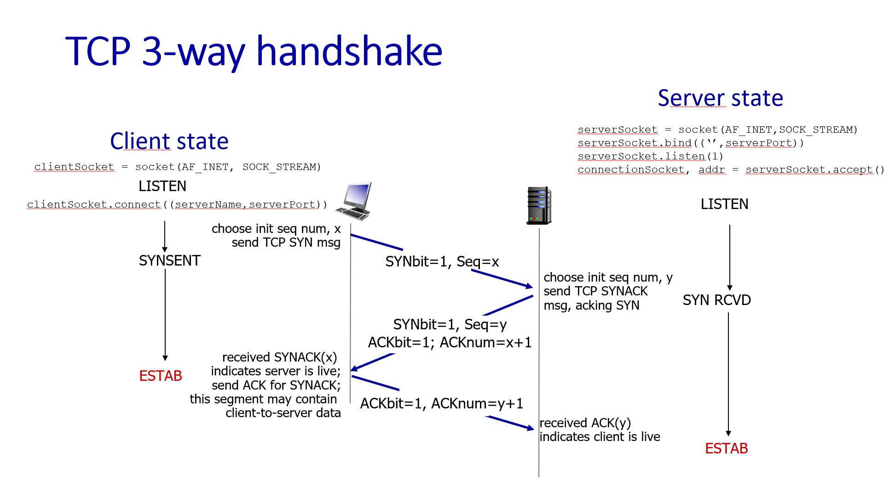

## 1. So sánh OSI 7 lớp với TCP/IP 4 lớp

Mô hình **OSI** mang tính lý thuyết, định nghĩa tiêu chuẩn hóa giúp các hệ thống khác nhau có thể giao tiếp. Trong khi đó, **TCP/IP** là mô hình thực tế, được tinh gọn và là nền tảng cấu tạo nên mạng Internet toàn cầu ngày nay.

| Tầng trong mô hình OSI (7 lớp)                                                            | Tầng trong mô hình TCP/IP (4 lớp)     | Chức năng chính & Giao thức phổ biến                                                                                                                                                  |
| :---------------------------------------------------------------------------------------- | :------------------------------------ | :------------------------------------------------------------------------------------------------------------------------------------------------------------------------------------ |
| **7. Application** (Ứng dụng) **6. Presentation** (Hiển thị) **5. Session** (Phiên) | **1. Application** (Ứng dụng)         | Giao tiếp trực tiếp với người dùng và phần mềm ứng dụng. Xử lý định dạng dữ liệu, mã hóa và quản lý phiên làm việc.  _Giao thức:_ `HTTP`, `HTTPS`, `FTP`, `DNS`, `SMTP`, `SSH`. |
| **4. Transport** (Giao vận)                                                               | **2. Transport** (Giao vận)           | Quản lý kết nối đầu-cuối (end-to-end), kiểm soát luồng dữ liệu, phân đoạn và sửa lỗi dữ liệu.  _Giao thức:_ `TCP`, `UDP`.                                                       |
| **3. Network** (Mạng)                                                                     | **3. Internet** (Mạng Internet)       | Định tuyến (routing) gói tin qua các mạng khác nhau bằng địa chỉ logic dựa trên IP.  _Giao thức:_ `IP` (IPv4/IPv6), `ICMP`, `ARP`.                                              |
| **2. Data Link** (Liên kết dữ liệu) **1. Physical** (Vật lý)                           | **4. Network Access** (Truy cập mạng) | Chuyển đổi dữ liệu thành các tín hiệu vật lý (điện, quang, sóng vô tuyến) và truyền đi trên phần cứng vật lý mạng.  _Công nghệ:_ `Ethernet`, `Wi-Fi`, `Cáp quang`.              |

## 2. TCP 3-way handshake & Cờ điều khiển

Ý nghĩa của các cờ điều khiển (Flags) trong TCP Header:

- SYN (Synchronize): Yêu cầu thiết lập kết nối. Dùng ở giai đoạn đầu tiên để thiết lập số thứ tự gói tin khởi đầu (Sequence Number).

- ACK (Acknowledgment): Xác nhận đã nhận được dữ liệu thành công. Trường Acknowledgment Number đi kèm sẽ chỉ ra số thứ tự tiếp theo mà bên gửi mong đợi nhận được.

- FIN (Finish): Yêu cầu chấm dứt kết nối một cách êm đẹp (Graceful shutdown) khi hai bên đã hoàn tất việc gửi và nhận toàn bộ dữ liệu.

- RST (Reset): Ép buộc hủy bỏ kết nối ngay lập tức. Thường xảy ra do gặp lỗi nghiêm trọng, gói tin không hợp lệ, hoặc thiết bị gửi yêu cầu tới một cổng (port) đang đóng.

## 3. Khi nào chọn UDP thay vì TCP? Ví dụ thực tế

- **Khi nào chọn**: Cần tốc độ cao, độ trễ thấp và chấp nhận mất mát một số lượng nhỏ gói tin . UDP không có cơ chế bắt tay, kiểm soát lỗi hay đảm bảo thứ tự gói tin nên nhanh và nhẹ hơn TCP.
- **Ví dụ thực tế**:
  - Live streaming (video/audio).
  - Video call (Zoom, Google Meet).
  - Game online thời gian thực.
  - Các giao thức như DNS, DHCP.

## 4. Số IP tương ứng CIDR /24, /16, /22

Công thức tính số IP: $2^{32 - n}$ (trong đó $n$ là prefix length). Ngoài ra có 2 địa chị IP/mạng và 1 địa chỉ broadcast nên số IP khả dụng là $2^{32 - n} - 2$

- **/24**: $2^{32-24} = 2^8 = 256$ IP (Khả dụng cho host: 254 IP).
- **/16**: $2^{32-16} = 2^{16} = 65,536$ IP (Khả dụng cho host: 65,534 IP).
- **/22**: $2^{32-22} = 2^{10} = 1,024$ IP (Khả dụng cho host: 1,022 IP).

## 5. Tại sao có Private IP range?

Địa chỉ IPv4 công cộng (Public IP) chỉ có khoảng 4.3 tỷ địa chỉ và hiện nay đã cạn kiệt. Để giải quyết vấn đề này, tổ chức IANA đã giữ lại 3 khối mạng lớn chỉ dùng trong mạng nội bộ (mạng gia đình, văn phòng, data center) gọi là Private IP:

- 10.0.0.0/8 (Từ 10.0.0.0 đến 10.255.255.255)

- 172.16.0.0/12 (Từ 172.16.0.0 đến 172.31.255.255)

- 192.168.0.0/16 (Từ 192.168.0.0 đến 192.168.255.255)

Lý do tồn tại:

- Tiết kiệm tài nguyên IP toàn cầu: Các router trên mạng Internet được cấu hình để tự động loại bỏ (drop) các gói tin có IP đích/nguồn thuộc dải Private. Nhờ đó, hàng triệu công ty/gia đình trên thế giới đều có thể tái sử dụng chung một dải mạng (ví dụ 192.168.1.0/24) trong nhà họ mà không sợ bị xung đột trên Internet.

- Tăng cường bảo mật: Thiết bị sử dụng Private IP không thể bị các hacker từ Internet bên ngoài "nhìn thấy" hoặc gửi gói tin tấn công trực tiếp, trừ khi có cấu hình mở cổng cụ thể từ Router.

## 6. NAT là gì? Phân biệt SNAT vs DNAT

NAT (Network Address Translation) là kỹ thuật thay đổi địa chỉ IP (nguồn hoặc đích) trong Header của gói tin khi nó đi qua một thiết bị định tuyến (Router/Firewall), đóng vai trò cầu nối dịch chuyển giữa mạng nội bộ (Private) và Internet (Public).

Phân biệt SNAT và DNAT:

- SNAT (Source NAT):
  - Cơ chế: Thay đổi IP nguồn (Source IP) của gói tin khi đi từ trong mạng nội bộ ra ngoài Internet (Biến đổi từ Private IP của máy con thành Public IP của Router).

  - Ứng dụng: Dùng khi các máy tính trong nhà/văn phòng muốn ra ngoài Internet để đọc báo, xem phim. Giúp hàng ngàn máy con lướt web mà chỉ cần tốn duy nhất 1 địa chỉ Public IP của nhà mạng cấp cho Router.

- DNAT (Destination NAT):
  - Cơ chế: Thay đổi IP đích (Destination IP) của gói tin khi đi từ bên ngoài Internet đi vào trong mạng nội bộ.

  - Ứng dụng: Thường được biết đến với tên gọi Port Forwarding. Dùng khi dựng một máy chủ Web Server có Private IP (192.168.1.100) nằm bên trong nhà, và muốn người dùng từ Internet gõ địa chỉ Public IP của Router mà vẫn đi trúng vào trang web chạy trên máy chủ nội bộ đó.

## 7. Sự khác nhau giữa Forward Proxy và Reverse Proxy

Forward Proxy

- Vị trí: Nằm gần phía người dùng cuối.
- Cơ chế hoạt động: Client cấu hình gửi mọi yêu cầu đi qua Forward Proxy $\rightarrow$ Proxy đại diện cho Client đi lấy dữ liệu từ Internet về. Các trang web trên Internet chỉ nhìn thấy IP của Proxy chứ không biết danh tính của Client thực sự đứng sau.
- Mục đích sử dụng: Vượt tường lửa/Chặn địa chỉ IP (Fake IP, VPN), tăng tốc độ lướt web bằng ache ở Client, hoặc giúp công ty kiểm soát và chặn nhân viên truy cập vào các trang web không hợp lệ.

Reverse Proxy

- Vị trí: Nằm ngay phía trước và bảo vệ cho cụm máy chủ ứng dụng.
- Cơ chế hoạt động: Người dùng từ Internet gọi lên hệ thống $\rightarrow$ Gặp Reverse Proxy đầu tiên $\rightarrow$ Reverse Proxy tự động điều phối yêu cầu đó tới một máy chủ Backend phù hợp ở phía sau. Người dùng hoàn toàn không biết cấu trúc mạng hay IP thật của các Backend Server.
- Mục đích sử dụng:
  - Load Balancing: Phân chia đều lưu lượng truy cập cho nhiều máy chủ phía sau để hệ thống không bị quá tải.
  - Bảo mật: Ẩn IP gốc của Server nhằm chống lại các cuộc tấn công mạng trực tiếp hoặc tấn công DDoS (Ví dụ tiêu biểu là Cloudflare).
  - SSL/TLS Termination: Đảm nhận việc giải mã HTTPS nặng nề ngay tại Proxy, giúp các máy chủ ứng dụng phía sau giảm tải và chỉ việc xử lý logic thuần túy qua HTTP.
