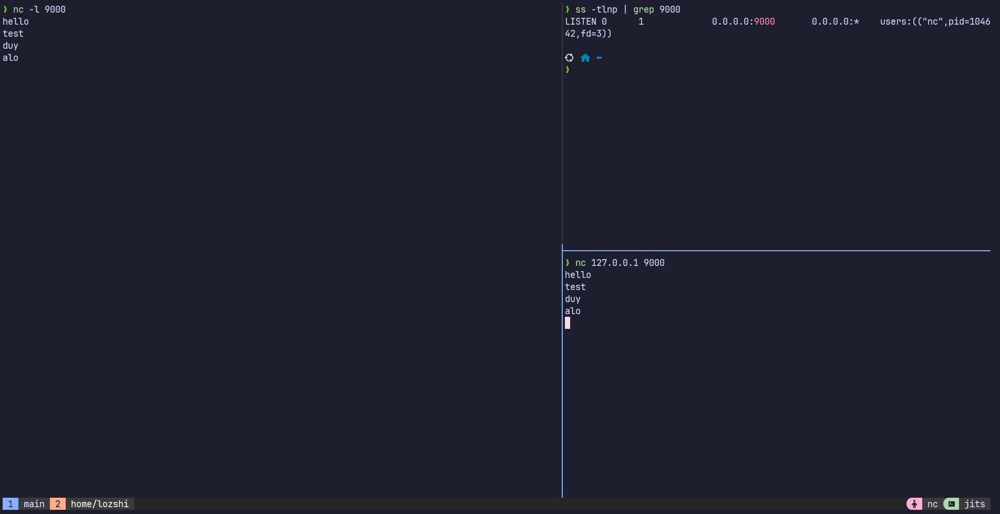

# Socket & Port Labs

## 1. Test Socket & Port

## 2. Phân biệt các lệnh `ss`

`ss` (Socket Statistics) là công cụ dòng lệnh mạnh mẽ dùng để kiểm tra thông tin các kết nối socket trên Linux (thay thế cho `netstat` cũ).

| Lệnh | Ý nghĩa các Flag | Chức năng chi tiết |
| :--- | :--- | :--- |
| **`ss -tln`** | <ul><li>`-t`: TCP sockets</li><li>`-l`: Listening</li><li>`-n`: Numeric ports</li></ul> | Liệt kê tất cả các cổng **TCP** đang ở trạng thái **LISTEN** (đang mở để chờ kết nối). Hiển thị số cổng trực tiếp (ví dụ: `80`, `22`) thay vì phân giải ra tên dịch vụ (`http`, `ssh`). |
| **`ss -uln`** | <ul><li>`-u`: UDP sockets</li><li>`-l`: Listening</li><li>`-n`: Numeric ports</li></ul> | Liệt kê tất cả các cổng **UDP** đang mở để nhận dữ liệu (UDP không duy trì kết nối nhưng vẫn bind cổng để lắng nghe). Hiển thị số cổng trực tiếp dạng số. |
| **`ss -anp`** | <ul><li>`-a`: All sockets</li><li>`-n`: Numeric ports</li><li>`-p`: Process information</li></ul> | Hiển thị **tất cả** các socket (cả TCP, UDP; cả đang lắng nghe `LISTEN`, đã kết nối `ESTABLISHED` hoặc chờ đóng). Đồng thời hiển thị **thông tin tiến trình (PID và tên tiến trình)** đang sở hữu socket đó (yêu cầu quyền `sudo` để xem đầy đủ tiến trình của hệ thống). |

---

## 3. Giải thích trạng thái Socket TCP

### A. LISTEN
- **Ý nghĩa**: Máy chủ (Server) đang sẵn sàng mở cổng dịch vụ và "lắng nghe" yêu cầu kết nối đi tới từ phía khách hàng (Client).
- **Ngữ cảnh**: Trạng thái ban đầu của một dịch vụ mạng (như Nginx lắng nghe cổng 80/443, SSH lắng nghe cổng 22) trước khi có bất kỳ kết nối thực tế nào được thiết lập.

### B. ESTABLISHED
- **Ý nghĩa**: Kết nối TCP đã được thiết lập thành công giữa Client và Server (sau khi hoàn thành bắt tay 3 bước).
- **Ngữ cảnh**: Cả hai bên hiện tại có thể thoải mái gửi và nhận dữ liệu qua lại với nhau.

### C. TIME_WAIT (Phía chủ động đóng kết nối)
- **Ý nghĩa**: Xuất hiện ở phía **chủ động đóng kết nối trước** (thường là Client). Sau khi gửi gói tin xác nhận đóng cuối cùng (`ACK`), socket sẽ được đưa vào trạng thái chờ `TIME_WAIT` trước khi đóng hoàn toàn.
- **Thời gian chờ**: Bằng $2 \times \text{MSL}$ (Maximum Segment Lifetime, thường là 1 - 2 phút).
- **Mục đích**:
  1. Đảm bảo gói tin xác nhận (`ACK`) cuối cùng đến được phía bên kia một cách an toàn. Nếu gói này thất lạc, bên kia sẽ gửi lại yêu cầu đóng kết nối (`FIN`) và ta vẫn còn ở trạng thái `TIME_WAIT` để gửi lại `ACK`.
  2. Đảm bảo tất cả các gói tin cũ còn sót lại trên mạng bị tiêu hủy hết, tránh trùng lặp hoặc gây nhiễu dữ liệu cho kết nối mới dùng trùng cặp IP/Port sau đó.

### D. CLOSE_WAIT (Phía bị động đóng kết nối)
- **Ý nghĩa**: Xuất hiện ở phía **nhận được yêu cầu đóng kết nối** từ bên kia trước. Socket ở trạng thái này để chờ ứng dụng phía mình xử lý nốt công việc và gọi lệnh đóng socket (`close()`).
- **Ngữ cảnh**: Hệ điều hành nhận được gói `FIN` từ bên kia, tự động trả lời `ACK` và báo cho ứng dụng local biết. Socket sẽ nằm ở trạng thái `CLOSE_WAIT` cho đến khi mã ứng dụng (application code) thực thi đóng kết nối hoàn toàn để gửi gói `FIN` đi.
- **Rủi ro**: Nếu ứng dụng bị treo hoặc có lỗi lập trình (không gọi hàm đóng kết nối), socket sẽ bị kẹt vĩnh viễn ở trạng thái `CLOSE_WAIT`, dẫn tới rò rỉ tài nguyên hệ thống (File Descriptor Leak).
