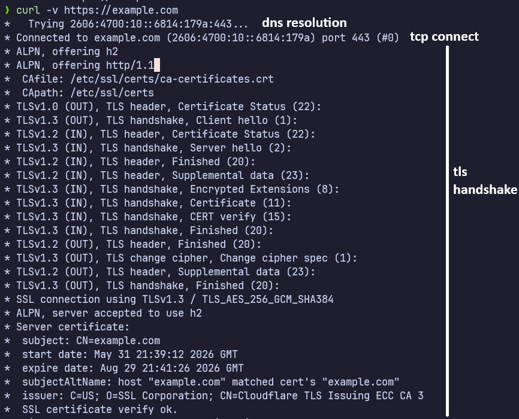
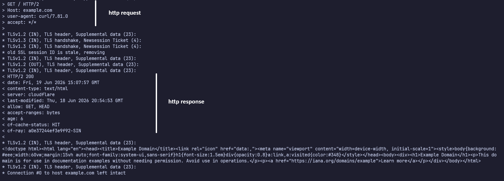

## 1. Phân tích output `curl -v https://example.com`

## 2. Dùng `openssl s_client -connect example.com:443 -showcerts`

## 3. TLS 1.3 Handshake (Đơn giản hóa)

## 4. Giải thích vai trò của các thuật ngữ TLS

### A. SNI (Server Name Indication)

- **Vai trò**: Là một phần mở rộng của giao thức TLS (TLS extension) gửi trong bản tin `ClientHello`.
- **Chức năng**: Cho phép Client chỉ rõ tên miền (domain name) mà nó đang muốn kết nối trước khi quá trình bắt tay mã hóa xảy ra. Điều này giúp máy chủ (nếu chạy nhiều website khác nhau trên cùng một địa chỉ IP) biết phải trả về đúng chứng chỉ SSL/TLS Certificate tương ứng của website đó.

### B. ALPN (Application-Layer Protocol Negotiation)

- **Vai trò**: Là phần mở rộng TLS cho phép đàm phán giao thức tầng ứng dụng.
- **Chức năng**: Giúp Client và Server thỏa thuận giao thức tầng ứng dụng nào sẽ được sử dụng (ví dụ: HTTP/1.1, HTTP/2 hoặc HTTP/3) ngay trong quá trình handshake TLS. Việc này tránh phát sinh thêm một lượt trao đổi (Round Trip) sau khi kết nối bảo mật đã được thiết lập, giúp cải thiện tốc độ tải trang.

### C. OCSP (Online Certificate Status Protocol)

- **Vai trò**: Giao thức kiểm tra trạng thái thu hồi của chứng chỉ số (Certificate Revocation).
- **Chức năng**: Client gửi truy vấn đến OCSP Responder của CA để kiểm tra xem chứng chỉ có còn hiệu lực hay đã bị thu hồi trước khi hết hạn.
- **OCSP Stapling**: Để tối ưu hiệu năng, máy chủ web định kỳ truy vấn CA để lấy thông tin trạng thái OCSP đã được CA ký số, sau đó "kẹp" (staple) kết quả này gửi trực tiếp cho Client trong quá trình bắt tay, giảm gánh nặng truy vấn cho Client và CA.

### D. SAN (Subject Alternative Name)

- **Vai trò**: Một trường mở rộng trong chứng chỉ số X.509.
- **Chức năng**: Cho phép một chứng chỉ SSL/TLS bảo vệ cho nhiều tên miền khác nhau (multi-domain) hoặc các địa chỉ IP, subdomains khác nhau trên cùng một chứng chỉ số duy nhất, thay vì chỉ giới hạn ở một tên miền duy nhất trong trường Common Name (CN).
