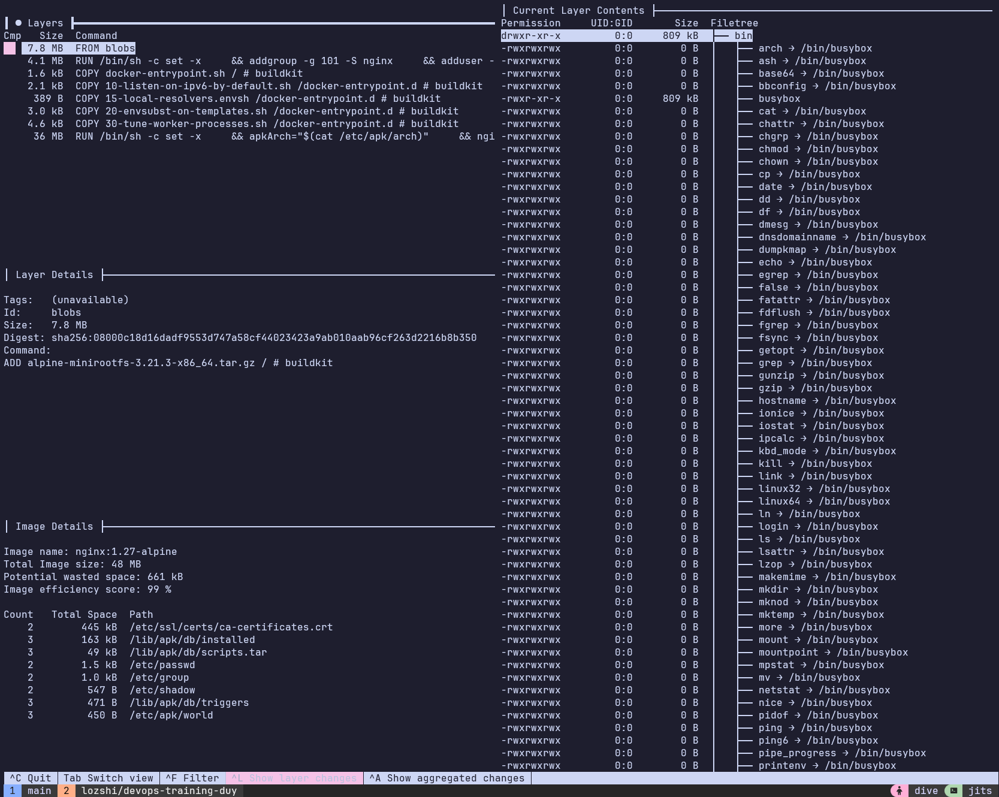
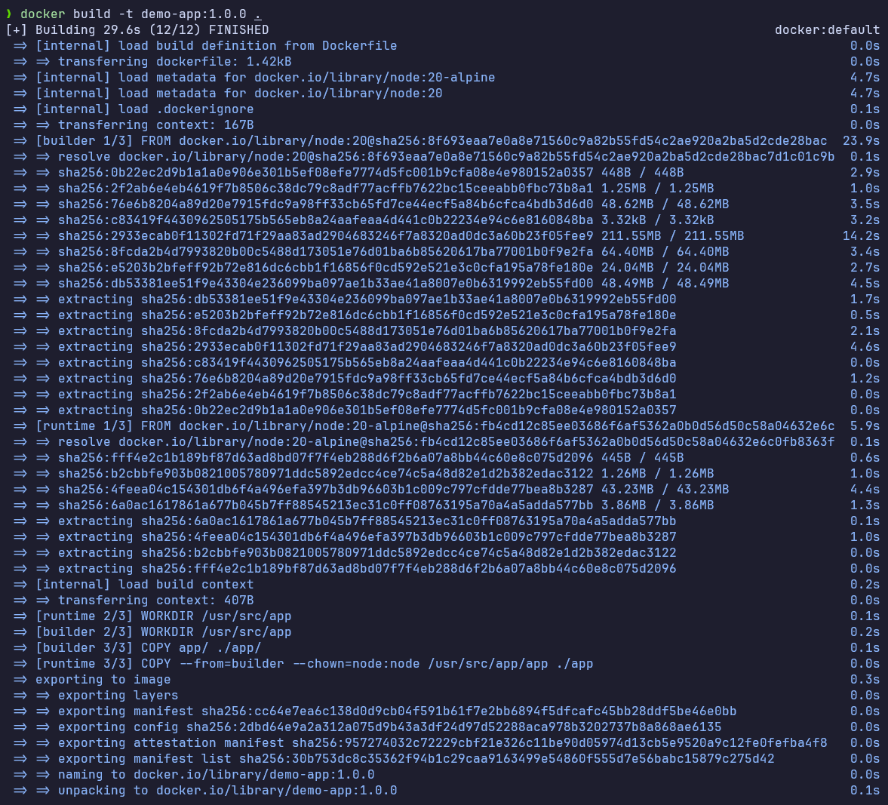
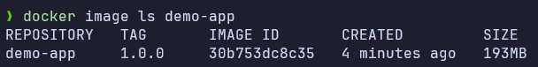
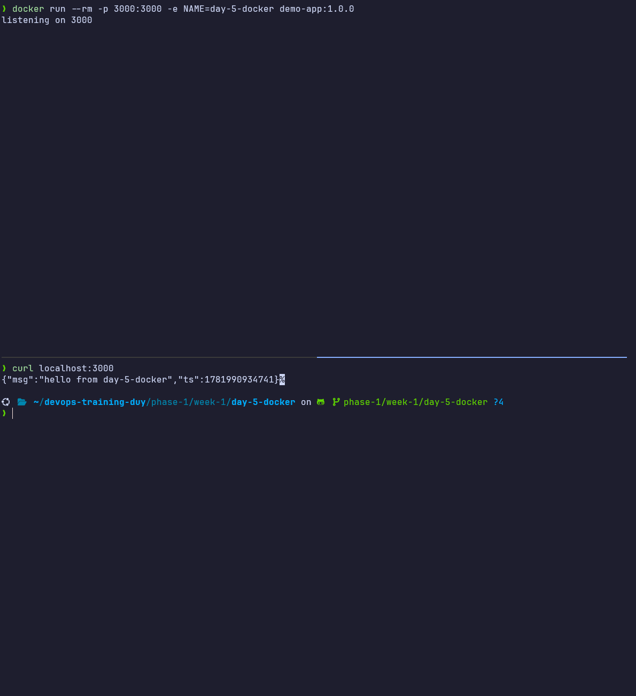
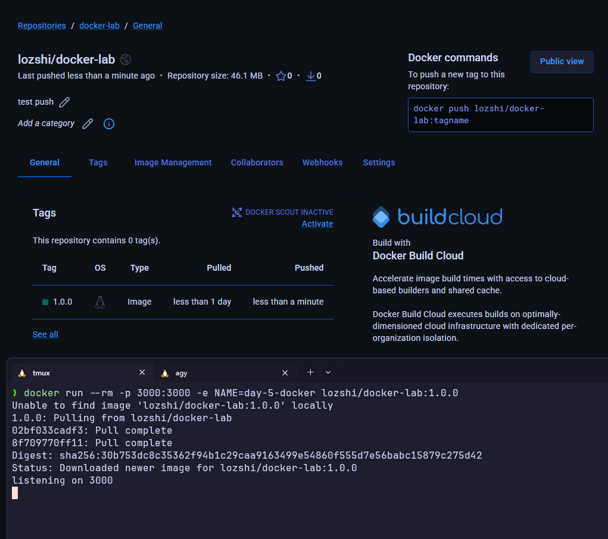
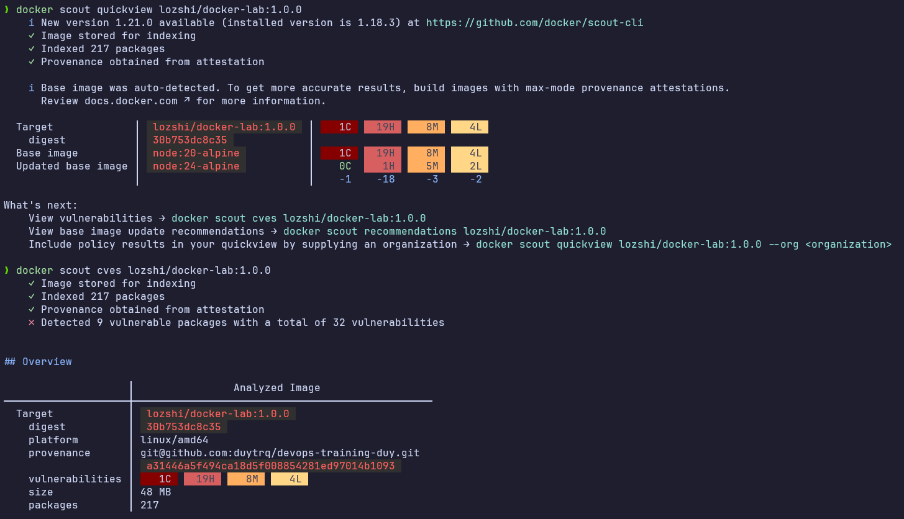

# Task: Docker Essentials

- **Intern**: Trương Quang Duy
- **Phase/Week/Day**: phase-1/week-1/day-5-docker
- **Branch**: phase-1/week-1/day-5-docker
- **Submitted at**: 2026-06-21
- **Time spent**: 4h

# 1. Mục Tiêu

Hiểu về các khái niệm cơ bản trong Docker (Layers, cache, COPY vs ADD, CMD vs ENTRYPOINT, .dockerignore, EXPOSE, bảo mật non-root). Thực hành tối ưu hóa Dockerfile (multi-stage build, giảm kích thước image < 200MB, cấu hình Healthcheck và Labels) và thiết lập môi trường nhiều container qua Docker Network, Volume (PostgreSQL persistence), Bind Mount (Nginx live reload).

---

# 2. Cách chạy và kết quả chi tiết

Chi tiết từng phần thực hiện được đính kèm trực tiếp tại các tệp tin dưới đây:

## Part A — Image internals

Tìm hiểu các câu hỏi lý thuyết quan trọng về layers, cache, phân biệt COPY/ADD, CMD/ENTRYPOINT, bảo mật container,...

- Xem chi tiết tại: [notes.md](notes.md)

Xem các layer của image `nginx:1.27-alpine`

## Part B — Dockerize 1 web app

Dockerfile chạy server Node.js (`app/server.js`) đáp ứng các tiêu chuẩn:

- Multi-stage build (Builder: `node:20`, Runtime: `node:20-alpine`).
- Chạy dưới quyền non-root user (`USER node`).
- Tích hợp `HEALTHCHECK` (sử dụng `wget`).
- Có `LABEL` chuẩn OCI (`org.opencontainers.image.*`).
- Kích thước image cuối nhẹ: **193MB** (< 200MB).
- Xem chi tiết tại: [Dockerfile](Dockerfile) và [.dockerignore](.dockerignore)

Kết quả:

- build:

  

- size:

  

- container:

  

## Part C — Network & volume

Cấu hình kết nối container và lưu trữ dữ liệu thực tế:

- Tạo bridge network `demo-net` để kết nối `app1` và `app2`, thực hiện curl thành công qua tên container.
- Mount Postgres với volume `pgdata`, bảo toàn dữ liệu sau khi restart container.
- Demo Bind Mount với Nginx, thay đổi nội dung file trên host và thấy sự thay đổi tức thì trên trình duyệt sau khi reload.
- Xem chi tiết các command đã dùng và output cụ thể tại: [network-volume.md](network-volume.md)

## Part D — Push Image

Sau khi push image `docker-lab:1.0.0` lên Dockerhub, thử pull về và run image:

## Part E - Sử dụng scout/trivy

# 3. Reference

- [Multi-stage builds](https://docs.docker.com/build/building/multi-stage/)
- [Best practices for writing Dockerfiles](https://docs.docker.com/develop/develop-images/dockerfile_best-practices/)
- [Open Container Initiative (OCI) Image Spec](https://github.com/opencontainers/image-spec/blob/main/annotations.md)
- [dive](https://github.com/wagoodman/dive)

- Sử dụng AI hỗ trợ tra cứu nhanh các syntax chưa biết.

---

# 4. Self-check

- [x] README có hướng dẫn và đường dẫn chi tiết cho từng phần.
- [x] Không hard-code các giá trị/bí mật nhạy cảm.
- [x] Đã build thành công Dockerfile và test các hành vi network/volume.
- [x] Đã review lại toàn bộ code và cấu hình.
