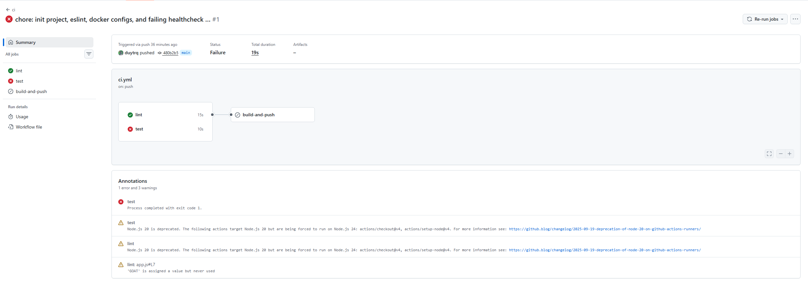
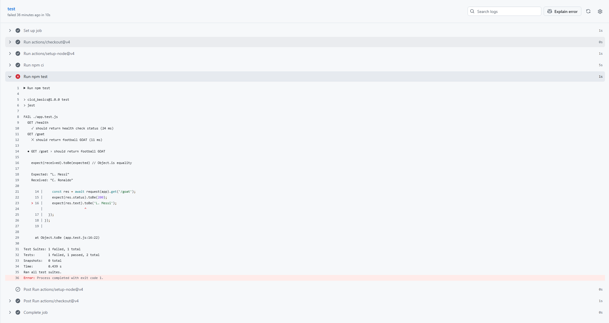
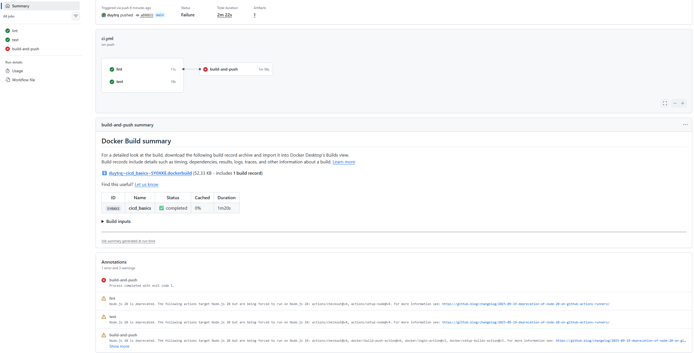
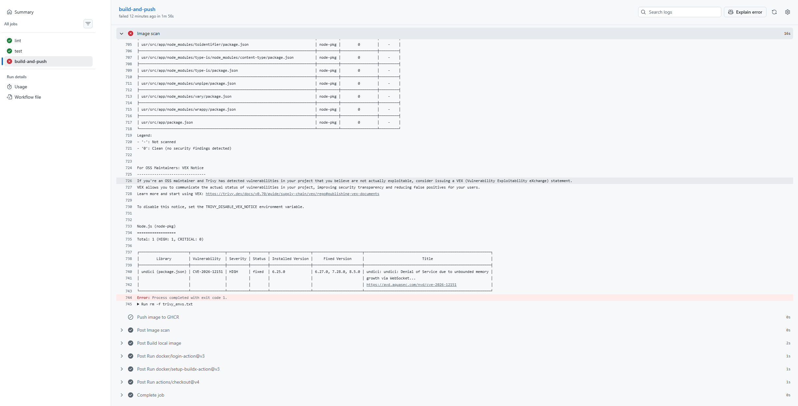
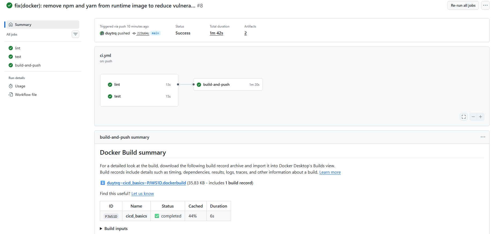
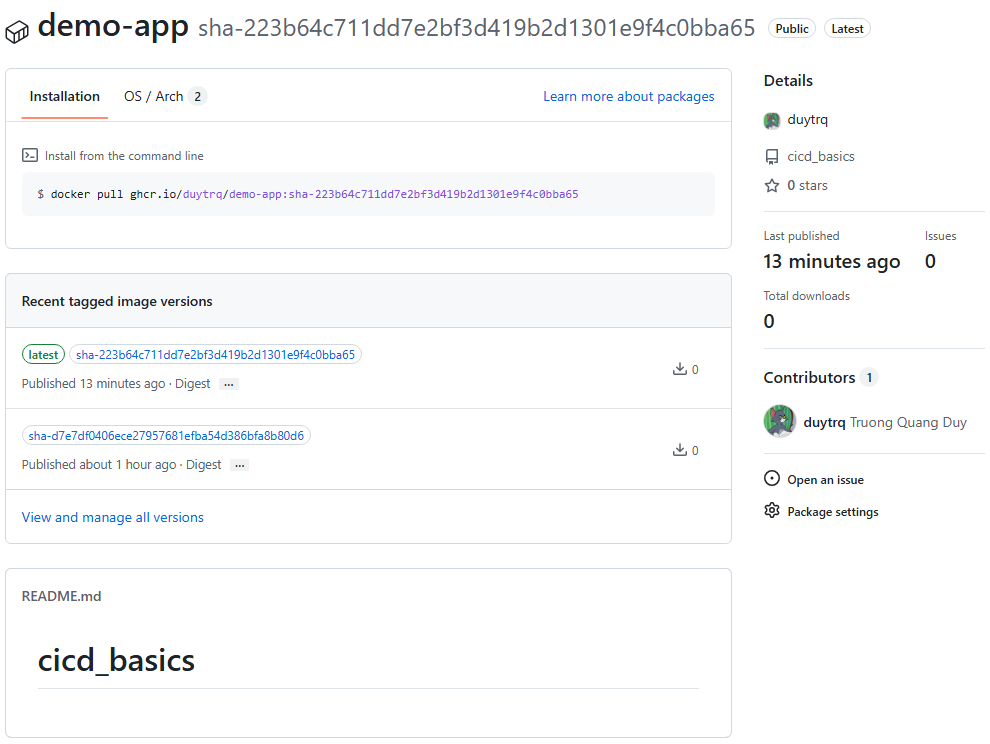

# Task: CI/CD Basics

- **Intern**: Trương Quang Duy
- **Phase/Week/Day**: phase-1/week-2/day-1-cicd-basics
- **Branch**: phase-1/week-2/day-1-cicd-basics
- **Submitted at**: 2026-06-23
- **Time spent**: 4h

# 1. Mục Tiêu

Hiểu được những khái niệm quan trọng trong CI/CD như: DORA, Pipeline as Code, runner. Triển khai một pipeline CI cơ bản bao gồm: lint, test, build, scan, push.

---

# 2. Cách chạy và kết quả chi tiết

## Part A — Lý thuyết CI/CD, DORA Metrics & Runners

Tìm hiểu các câu hỏi lý thuyết quan trọng về phân biệt các khái niệm CI/CD, ý nghĩa các metric DORA, điểm mạnh của Pipeline as Code, và cách chọn runner.

- Xem chi tiết tại: [notes.md](notes.md)

## Part B — Demo một pipeline

Link github: https://github.com/duytrq/cicd_basics

Ở pipeline này, em chạy một luồng cơ bản là lint + test $\rightarrow$ build $\rightarrow$ trivy scan $\rightarrow$ push.

Trong đó Lint và Test được chạy song song để có thể fix cùng lúc.

### Kịch bản Lint/Test fail

Pipeline failed do 1 testcase ko pass

Cụ thể:

Ở đây hiện rõ là `/goat` return sai là C. Ronaldo, expect L. Messi.

---

### Kịch bản build image có vul High/Critical

Sau khi fix bug và pass hết testcase, chuyển qua job build và push.

Cụ thể, sử dụng trivy để quét và ra được vul `CVE-2026-12151`

### Pipeline chạy thành công

Sau khi fix vul quét được ở trên, pipeline chạy đã xanh:

Package đã được build thành công:

# 3. Khó khăn

- khi fix vul `CVE-2026-12151`, đã thử sửa `package.json` sử dụng version mới cho `undici`, quét trivy ở local đã hết vul nhưng khi chạy pipeline thì chưa fix được $\rightarrow$ fix bằng cách sửa Dockerfile ở stage runtime xoá `node_modules` của base image, vừa giảm size vừa fix được vul.

# 4. Reference

- [GitHub Actions Documentation](https://docs.github.com/en/actions)
- [DORA Metrics - Google Cloud](https://cloud.google.com/devops/guides/dora-metrics)
- [build-push-action](https://github.com/marketplace/actions/build-and-push-docker-images)
- [trivy-action](https://github.com/aquasecurity/trivy-action)
- Em sử dụng AI để tra cứu nhanh những lệnh và keywords mới.

---

# 5. Self-check

- [x] Pipeline xanh ít nhất 1 lần.
- [x] Image push thành công lên GHCR.
- [x] Có ít nhất 1 lần pipeline đỏ do test/lint fail (chứng minh CI hoạt động).
- [x] Cache hoạt động (job thứ 2 chạy nhanh hơn).
