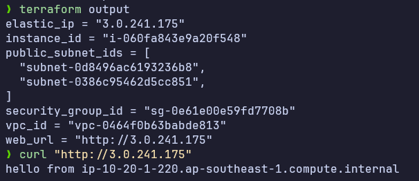
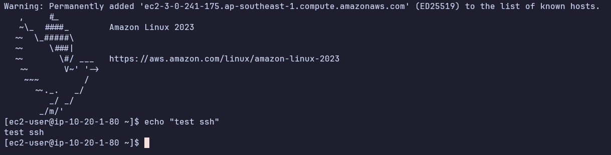
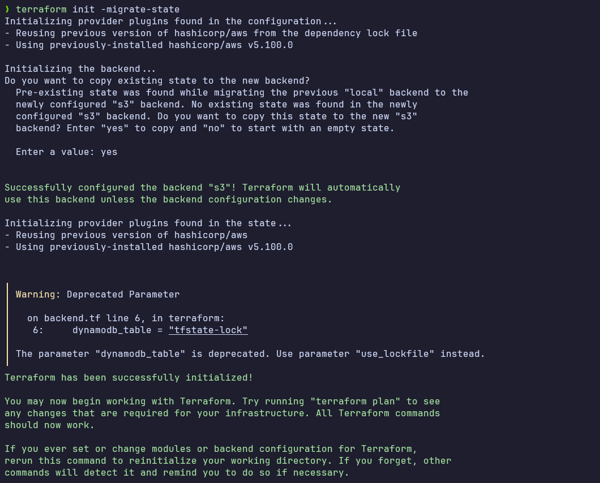
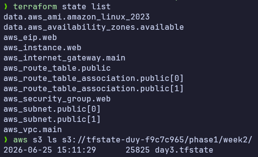

# Task: Terraform Basics

- **Intern**: Trương Quang Duy
- **Phase/Week/Day**: phase-1/week-2/day-3-terraform
- **Branch**: phase-1/week-2/day-3-terraform
- **Submitted at**: 2026-06-23
- **Time spent**: 4h

# 1. Mục Tiêu

- Hiểu mô hình IaC declarative.
- Nắm vững: provider, resource, variable, output, state, data source.
- Provision được hạ tầng cơ bản trên AWS.

# 2. Cách chạy và kết quả chi tiết

## Part A — Lý thuyết

Xem chi tiết trong [này](notes.md)

## Part B — Mini lab 1: Local-only

Triển khai một resource ở local, các file `.tf` ở trong folder [này](./1-local/), ở đây IaC này sẽ tạo một file ở trong folder `out` với tên file là `hello-${random_pet.name.id}.txt`. Trong đó `random_pet_name` cũng được random với length là input.

Khi đổi `length` từ 2->3, terraform destroy file vừa tạo và tạo lại file mới với `random_pet.name.id` có độ dài 3.

### Kết quả

Transcript của quá trình xây hạ tầng được log lại trong [log](./1-local/1-local-transcript.log)

Đọc transcript bằng cách:

```bash
cat 1-local/1-local-transcript.log ## do file log ngắn
```

## Part C — Mini lab 2: AWS VPC + EC2

Chi tiết triển khai ở trong [này](./2-aws/README.md)

### Kết quả





### Part D — Remote backend

Sau khi tạo bucket `tfstate-duy-f9c7c965` và DynamoDB table `tfstate-lock` và thêm file `2-aws\backend.tf` với config:

```hcl
terraform {
  backend "s3" {
    bucket         = "tfstate-duy-f9c7c965"
    key            = "phase1/week2/day3.tfstate"
    region         = "ap-southeast-1"
    dynamodb_table = "tfstate-lock"
    encrypt        = true
  }
}
```

### Kết quả



Trên s3:



# 3. Khó khăn

# 4. Reference

- [terraform language doc](https://developer.hashicorp.com/terraform/language)
- [aws provider doc](https://registry.terraform.io/providers/hashicorp/aws/latest/docs)
- [small size terraform best practice](https://github.com/antonbabenko/terraform-best-practices/tree/master/examples/small-terraform)

---

# 5. Self-check

- [x] Lab 1 chạy plan/apply/destroy đúng.
- [x] Lab 2: curl được nginx qua public IP.
- [x] Đã `terraform destroy` sạch.
- [x] Không commit `*.tfstate` / `*.tfvars` thật.
