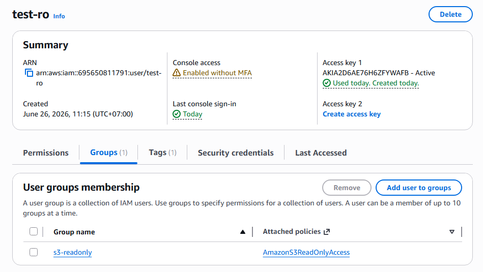
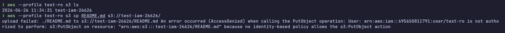
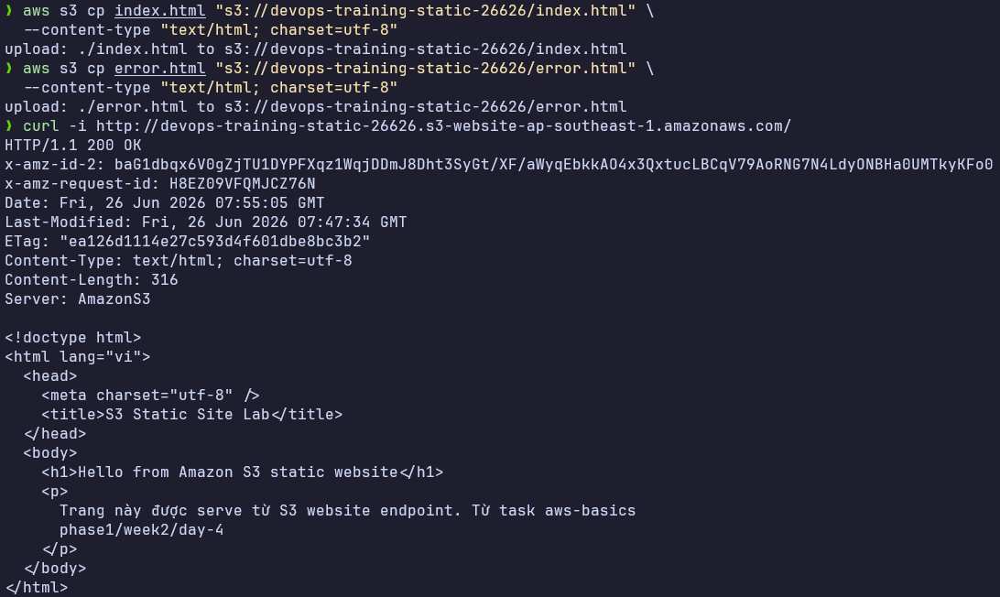
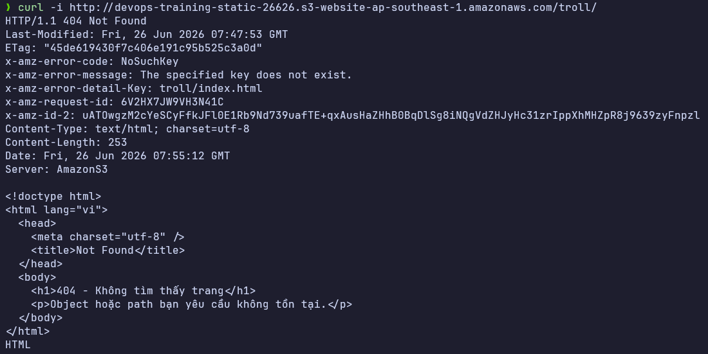
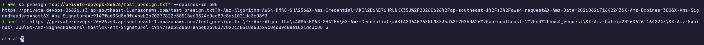
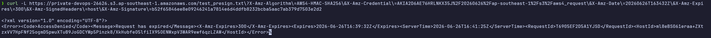

# Task: Aws Basics

- **Intern**: Trương Quang Duy
- **Phase/Week/Day**: phase-1/week-2/day-4-aws-basics
- **Branch**: phase-1/week-2/day-4-aws-basics
- **Submitted at**: 2026-06-27
- **Time spent**: 6h

# Mục Tiêu

Hiểu IAM (user, group, role, policy, trust policy). Hiểu hơn về S3: bucket policy, static site, presigned URL. Nắm sơ đồ VPC, subnet public/private, NAT, IGW. Biết khái niệm: region, AZ, edge location.

# Cách chạy và triển khai

## Part A — IAM

Trả lời các câu hỏi trong [này](./notes.md)

## Part B — Lab IAM

Sau khi config trên IAM console, được kết quả như sau:



Test access:



## Part C — S3 static site

### Triển khai

Thực hiện tạo bucket và config trên s3 console với các bước sau:

1. Tạo bucket

2. Tắt Block Public Access cho bucket này

   Giải thích:
   - `BlockPublicPolicy=false` cho phép gắn bucket policy public.
   - `RestrictPublicBuckets=false` cho phép principal public dùng policy đó.
   - Đây chỉ là cấu hình cho lab. Production nên tránh public bucket nếu có thể.
   - Nếu account-level Block Public Access vẫn đang bật, bucket policy public có thể vẫn bị chặn. Khi đó cần kiểm tra trong S3 Console: **Block Public Access settings for this account**.

3. Bật static website hosting

   Cấu hình S3 website hosting với `index.html` và `error.html`:

4. Upload file lên bucket

   Upload 2 file HTML:

   ```bash
   aws s3 cp index.html "s3://$BUCKET/index.html" \
     --content-type "text/html; charset=utf-8"

   aws s3 cp error.html "s3://$BUCKET/error.html" \
     --content-type "text/html; charset=utf-8"
   ```

5. Gắn bucket policy public `GetObject`

   Tạo file policy:

   ```bash
   {
     "Version": "2012-10-17",
     "Statement": [{
       "Effect": "Allow", "Principal": "*",
       "Action": "s3:GetObject",
       "Resource": "arn:aws:s3:::<bucket>/*"
     }]
   }
   ```

   Giải thích từng trường policy:
   - `Version`: version của policy language. `2012-10-17` là version chuẩn hiện nay.
   - `Statement`: danh sách rule trong policy.
   - `Sid`: tên mô tả statement, giúp đọc/audit dễ hơn.
   - `Effect: Allow`: cho phép nếu request match statement.
   - `Principal: "*"`: mọi principal trên internet đều có thể match statement này.
   - `Action: s3:GetObject`: chỉ cho phép đọc object, không cho list bucket, upload, sửa, hoặc xóa.
   - `Resource: arn:aws:s3:::<bucket>/*`: áp dụng cho toàn bộ object trong bucket, không áp dụng cho chính bucket.

6. Truy cập website endpoint

   Mở URL trên browser. Kết quả mong đợi:
   - Truy cập `/` thấy nội dung trong `index.html`.
   - Truy cập `/not-exist.html` thấy nội dung trong `error.html`.

   Có thể kiểm tra bằng CLI:

   ```bash
   curl -i "http://$BUCKET.s3-website-$AWS_REGION.amazonaws.com"
   curl -i "http://$BUCKET.s3-website-$AWS_REGION.amazonaws.com/not-exist.html"
   ```

### Kết quả:





## Part D — Presigned URL

### 1. Tạo bucket private trên S3 Console

Cấu hình:

- **Bucket name**: đặt theo format `private-<tên>-<random>`.
- **AWS Region**: `ap-southeast-1`.
- **Object Ownership**: để mặc định `ACLs disabled`.
- **Block Public Access settings**: giữ **Block all public access** là **ON**.
- **Bucket Versioning**: có thể để `Disable` cho lab.
- **Default encryption**: giữ mặc định `SSE-S3` nếu AWS tự bật.

Giải thích:

- Bucket này private vì mục tiêu là test presigned URL, không phải public website.
- Block Public Access ON nghĩa là người ngoài không thể đọc object trực tiếp.
- Presigned URL không làm bucket public. Nó chỉ tạo một URL tạm thời được ký bằng quyền của IAM principal tạo URL.

Sau khi tạo xong, ghi lại tên bucket để dùng ở các bước sau:

### 2. Upload file `test_presign.txt`

### 3. Generate presigned URL TTL 5 phút bằng AWS CLI

Chạy lệnh:

```bash
aws s3 presign "s3://$BUCKET/test_presign.txt" --expires-in 300
```

Giải thích:

- `aws s3 presign`: tạo URL tạm thời cho object S3.
- `s3://$BUCKET/test_presign.txt`: object cần chia sẻ.
- `--expires-in 300`: thời hạn URL là 300 giây, tức 5 phút.
- IAM user/role đang chạy lệnh phải có quyền `s3:GetObject` trên object đó.

### 4. Test URL

Copy URL vừa tạo và mở trên browser.

Kết quả mong đợi:

- Trong vòng 5 phút: tải được hoặc xem được file `test_presign.txt`.
- Sau 5 phút: URL hết hạn, request bị từ chối.

Có thể test bằng CLI:

```bash
curl -L -o test_presign.txt "<presigned-url>"
```

Nếu chỉ muốn xem HTTP status, dùng `GET` và bỏ output:

```bash
curl -L -o /dev/null -w "%{http_code}\n" "<presigned-url>"
```

Kết quả:

Curl thành công:



Sau 5 phút:



### 5. Script Python `presign.py` dùng `boto3`

Chạy script:

```bash
python3 presign.py \
  --bucket "$BUCKET" \
  --key test_presign.txt \
  --expires-in 300
```

Giải thích:

- `boto3.client("s3")` tạo S3 client dựa trên credential AWS hiện tại.
- `generate_presigned_url()` ký request `get_object`.
- `Bucket` là tên bucket private.
- `Key` là object key, ở đây là `test_presign.txt`.
- `ExpiresIn=300` tạo URL hết hạn sau 5 phút.

## Part E — VPC topology

Trả lời các câu hỏi trong [này](./notes.md)

# Reference

- [iam best practices](https://docs.aws.amazon.com/IAM/latest/UserGuide/best-practices.html)
- [s3 static site hosting](https://docs.aws.amazon.com/AmazonS3/latest/userguide/WebsiteHosting.html)
- [vpc](https://docs.aws.amazon.com/vpc/latest/userguide/what-is-amazon-vpc.html)

# Self check

- [x] IAM user `test-ro` bị Deny đúng theo policy.
- [x] Static site truy cập được public.
- [x] Presigned URL hoạt động & expire đúng.
- [x] Sau dọn dẹp không còn resource paid.
